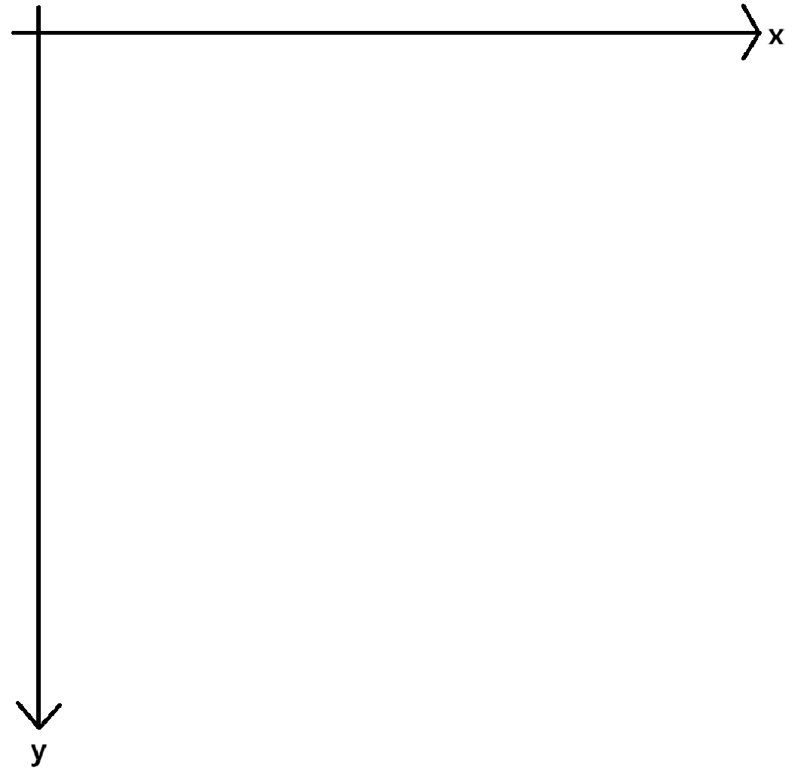

# Introduction to Animations

### ✅ The difference of a normal coordinate plane to an animation coordinate plane

A normal coordinate plane is made in such a way where the x and y axis makes a cross.

However, an animation coordinate plane is made in a different way, as shown below.



The coordinates also work differently. The further the y axis goes down, it increases. Ex. Coordinate (1,1): 1 left, 1 down of top left

### ✅ Terms

**Frame** : a single still image within a sequence that, when displayed rapidly in succession, creates the illusion of movement.

**FPS(Frames Per Second)** : the number of individual images or frames displayed in a video or animation every second.

### ✅ Code examples

#### DVD Code on Pygame

```python 
import pygame
import sys

from pygame.examples.eventlist import virtual_x

# default
pygame.init()

# set screen size
screen_width = 640
screen_height = 320
screen = pygame.display.set_mode((screen_width, screen_height))
FPS = 60
rad=20
x = 0+rad
y = 0+rad
v_x = 3
v_y = 4

# set title
pygame.display.set_caption("Pygame")

# set FPS settings by clock
clock = pygame.time.Clock()


# Main Loop
running = True
while running:
    # FPS limit(60)
    clock.tick(FPS)

    # Events action
    for event in pygame.event.get():
        if event.type == pygame.QUIT:
            running = False

    # Filling screen
    screen.fill((255, 255, 255))  # 검은색 배경
    pygame.draw.circle(screen, (0, 0, 0), (x, y), rad)
    x += v_x
    y += v_y
    if x + rad >= screen_width or x - rad <= 0:
        v_x *= -1
    if y + rad >= screen_height or y - rad <= 0:
        v_y *= -1
    # Update screen
    pygame.display.flip()

# Close
pygame.quit()
sys.exit()
```


