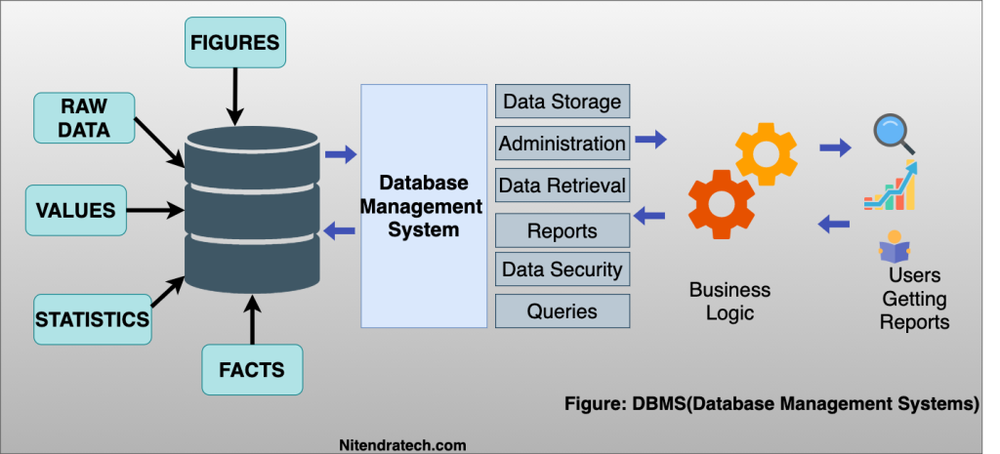
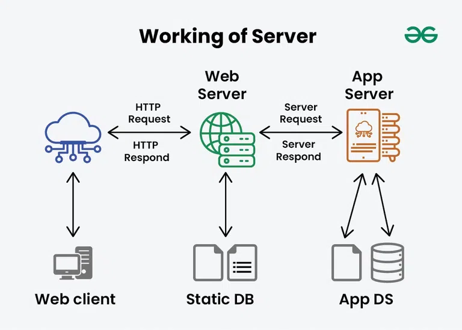

# 📘Database and Servers

### 📗What is a Database?

A database is an organised set or collection of data that can easily be accessed, managed, and altered. It acts as a structured storage system where information is kept in a way that makes retrieval and manipulation efficient.

#### Key points

**Purpose**: Responds to client requests, processes data, and delivers results.

##### Types of Servers:

**Web Server**: Delivers web pages (e.g., Apache, Nginx).

**Database Server**: Hosts and manages databases.

**Application Server**: Runs application logic between client and database.

**File/Storage Server**: Stores and shares files.

##### How It Works:

- Clients send requests (e.g., HTTP request for a webpage).

- The server processes the request.

- The server responds with the appropriate data (e.g., HTML, JSON, images).

**Client-Server Model**:

- Clients depend on servers for data and services.

- Servers can handle multiple clients simultaneously.

**Key Features**:

- Always On: Typically runs continuously to serve clients.

- Scalable: Can handle more clients by adding resources.

- Secure: Protects data through authentication, encryption, and firewalls.

### 📗What is a Server?

A **server** is a computer system or software that provides services, resources, or data to other computers (called clients) over a network.

#### Key Points

**Purpose**: Responds to client requests, processes data, and delivers results.

##### Types of Servers:

**Web Server**: Delivers web pages (e.g., Apache, Nginx).

**Database Server**: Hosts and manages databases.

**File/Storage Server**: Stores and shares files.

##### How It Works:

- Clients send requests (e.g., HTTP request for a webpage).

- The server processes the request.

- The server responds with the appropriate data (e.g., HTML, JSON, images).

##### Client-Server Model:

- Clients depend on servers for data and services.

- Servers can handle multiple clients simultaneously.

