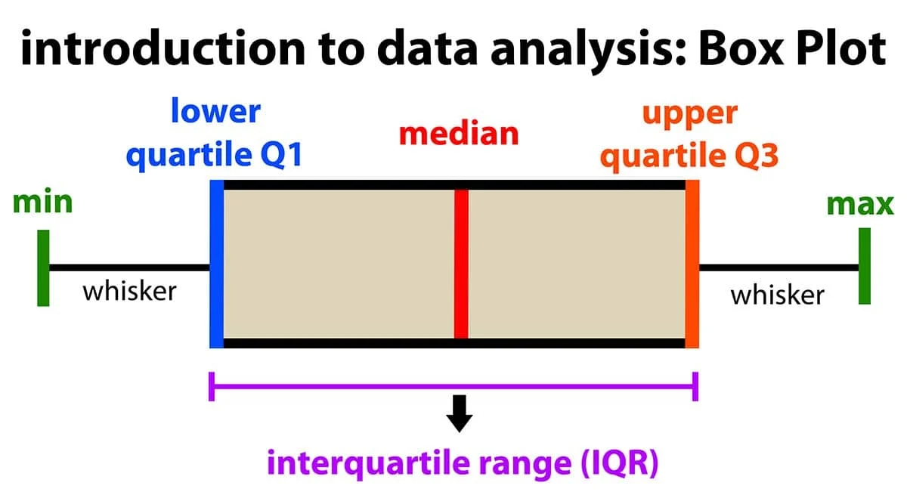
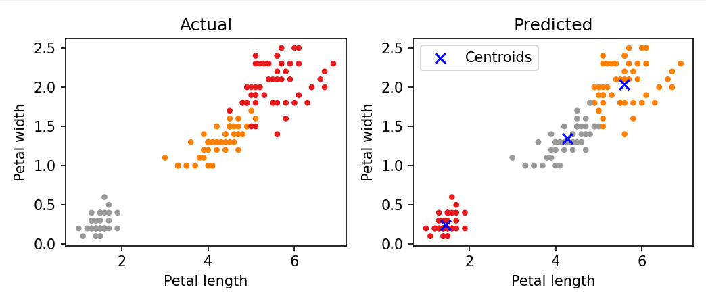
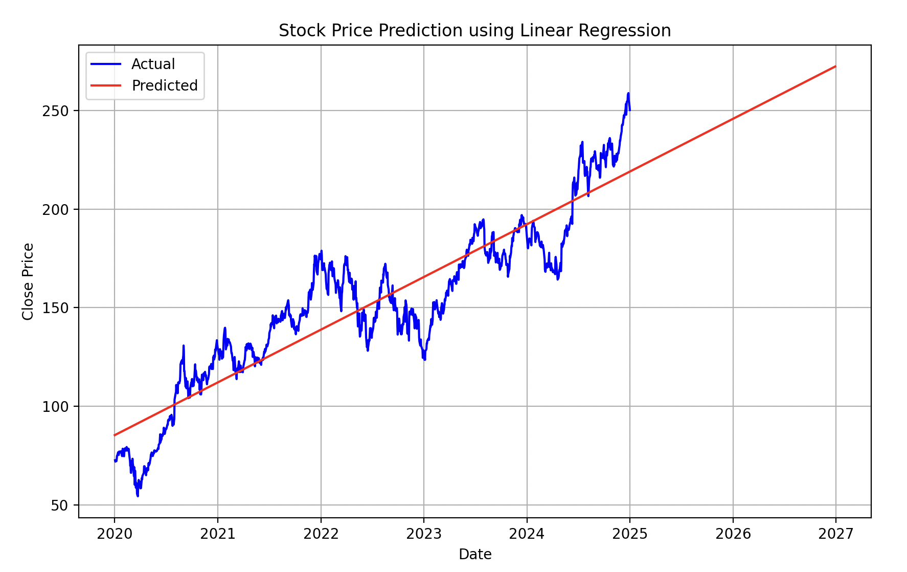

# AI, Machine Learning (ML), and Deep Learning (DL)

- **AI (Artificial Intelligence):** Includes all technologies that mimic human learning, reasoning, and problem-solving.
- **ML (Machine Learning):** A subset of AI that uses data to learn patterns and make predictions.
- **DL (Deep Learning):** A further subset of ML that uses neural networks to learn automatically from large datasets.

## 🏷️ Part 1: AI Categories

### ✅ Machine Learning vs Deep Learning

| **Category**        | **Machine Learning**                                          | **Deep learning**                         |
| ----------------  | -------------------------------------------------------   |   ------------------------------------------------ |
| **Definition**        | Development of AI that can learn and adapt via algorithm  | Subset of Machine Learning that uses Neural Networks|
| **Characteristics**   | Predicts by finding patterns from a data                        | Automatically extracts characteristics via multilayered Neural Networks. |
| **Data Dependency**   | ↓ Low                                                           | ↑ High                                               |
| **Learning speed**    | Fast                                                            | Slow                                             | 
| **Model Examples**    | SVM, Random Forest, KNN, Linear Regression, Logistic Regression, etc | CNN, RNN, LSTM, GAN, Transformer, etc                  |
| **Application Areas**          | Recommendation systems, Predicting diseases, financial modeling | Image recognition, Voice recognition, autonomous driving, translation, generative AI        |

### ✅ Supervised vs Unsupervised Learning

| Category          | **Supervised Learning**                                                                         | **Unsupervised Learning**                                        |
| ----------------- | ----------------------------------------------------------------------------------------------- | ---------------------------------------------------------------- |
| **Definition**    | Learning from data that includes labels (answers)                                               | Learning from data **without** labels|
| **Goal**          | Predict the correct label/output based on input data                                            | Discover hidden patterns within the data|
| **Input Data**    | Pairs of (input, label) are available                                                           | Only input values are present (no labels) |
| **Output**        | Predict specific labels (classification) or numerical values (regression)                       | Discover groups (clusters) or underlying patterns |
| **Common Models** | KNN, SVM, Decision Tree, Random Forest, Linear Regression, Logistic Regression, Neural Networks | K-Means, DBSCAN, PCA, Cluster Analysis, Association Rules |
| **Examples**      | Spam classification, handwritten digit recognition, price prediction                            | Customer segmentation, anomaly detection, recommendation systems |


## 🏷️ Part 2: Libraries

### ✅ Numpy

- Fast calculation of the Matrix

### ✅ Pandas

- Showing a graph version of a data

### ✅ Matplotlib

- Static, interactive, and animated visualizations

## 🏷️ Part 3 : Boxplot



### ✅ Terms of boxplot

| Term                          | Description                                                                                                  |
| :---------------------------- | :----------------------------------------------------------------------------------------------------------- |
| **Minimum**                   | Position 1.5 IQR below the first quartile (Q1)                                                               |
| **First Quartile (Q1)**       | Marks the 25% position at the bottom of the box                                                              |
| **Second Quartile (Q2)**      | Median represented by the line inside the box, indicating 50% position                                       |
| **Third Quartile (Q3)**       | Marks the 75% position at the top of the box                                                                 |
| **Maximum**                   | Position 1.5 IQR above the third quartile (Q3)                                                               |
| **Interquartile Range (IQR)** | The range between Q1 and Q3                                                                                  |
| **Whisker**                   | Extends from the box to indicate the range of the data, up to the smallest and largest values within 1.5 IQR |
| **Outlier**                   | Data points beyond the minimum and maximum; if any exist, they are plotted beyond the whiskers               |

### ✅ boxplot sample code

```py
import matplotlib.pyplot as plt
import numpy as np

np.random.seed(10) # numpy random init
data = np.random.randn(50) * 10
data = np.append(data, [50, -40])

plt.boxplot(data)

plt.title("Box Plot with Outliers")
plt.ylabel("Value")
plt.show()
```

## 🏷️ Part 4 : Dataset

| uses iris dataset for easier understanding

### ✅ iris dataset

| Sepal Length (cm) | Sepal Width (cm) | Petal Length (cm) | Petal Width (cm) | Species |
| ----------------- | ---------------- | ----------------- | ---------------- | ------- |
| 5.1               | 3.5              | 1.4               | 0.2              | setosa  |
| 4.9               | 3.0              | 1.4               | 0.2              | setosa  |
| 4.7               | 3.2              | 1.3               | 0.2              | setosa  |
| 4.6               | 3.1              | 1.5               | 0.2              | setosa  |
| 5.0               | 3.6              | 1.4               | 0.2              | set     |

## 🏷️ Part 5 : ML

### ✅ Classification : KNN

#### ⚙️ sample code

```py
import numpy as np
import pandas as pd
import matplotlib.pyplot as plt
from sklearn.datasets import load_iris
from sklearn.model_selection import train_test_split
from sklearn.preprocessing import StandardScaler
from sklearn.neighbors import KNeighborsClassifier
from sklearn.metrics import accuracy_score

# 1. Load Iris dataset (150 samples)
iris = load_iris()  # 150 samples
X = iris.data  # Feature data (sepal and petal length/width)
y = iris.target  # Labels (0: Setosa, 1: Versicolor, 2: Virginica)

# 2. Split data into training (80%) and test (20%) sets
X_train, X_test, y_train, y_test = train_test_split(X, y, test_size=0.2, random_state=42)

# 3. Data scaling (KNN is distance-based, so normalization is essential)
scaler = StandardScaler()
X_train = scaler.fit_transform(X_train)
X_test = scaler.transform(X_test)

# 4. Train KNN model (K=5)
knn = KNeighborsClassifier(n_neighbors=5)
knn.fit(X_train, y_train)

# 5. Prediction and evaluation
y_pred = knn.predict(X_test)
accuracy = accuracy_score(y_test, y_pred)
print(f"KNN Accuracy: {accuracy:.4f}")

# 6. Predict for a sample data point (new iris data input)
new_sample = np.array([[5.1, 3.5, 1.4, 0.2]])  # Similar to Setosa
new_sample_scaled = scaler.transform(new_sample)
predicted_class = knn.predict(new_sample_scaled)
print(f"Predicted class: {iris.target_names[predicted_class][0]}")
```

**output**

```
KNN 정확도: 1.0000
예측된 품종: setosa
```

#### ⚙️ Summary of KNN

K-Nearest Neighbors (KNN) is a simple and widely used machine learning algorithm. It classifies new data points based on the labels of the K closest data points.

#### ⚙️ How KNN Works

1. When a new data point is given, find the K nearest data points in the existing dataset.

2. Determine the most common class (species) among those K points.

3. Assign the new data point to that class.

### ✅ Clustering : K-means



#### ⚙️ sample code

```py
from sklearn import datasets
from sklearn.cluster import KMeans
import matplotlib.pyplot as plt

iris = datasets.load_iris()

X = iris.data[:, 2:]  # Petal length and petal width
y = iris.target  # Actual species labels

kmeans = KMeans(n_clusters=3, random_state=21)  # n_clusters=3 means dividing into 3 clusters
kmeans.fit(X)  # Learn the K-Means model

y_pred = kmeans.labels_  # Cluster labels predicted by K-Means

centers = kmeans.cluster_centers_  # Cluster centroids

fig, axes = plt.subplots(1, 2, figsize=(7, 3))  # Two subplots side by side

axes[0].scatter(X[:, 0], X[:, 1], c=y, cmap='Set1_r', s=10)  # Color by actual labels
axes[0].set_xlabel('Petal length')  # x-axis label
axes[0].set_ylabel('Petal width')  # y-axis label
axes[0].set_title('Actual')  # Title: actual species

axes[1].scatter(X[:, 0], X[:, 1], c=y_pred, cmap='Set1', s=10) # Color by K-Means predictions
axes[1].set_xlabel('Petal length')  # x-axis label
axes[1].set_ylabel('Petal width')  # y-axis label
axes[1].set_title('Predicted')  # Title: predicted clusters for K-Means

axes[1].scatter(centers[:, 0], centers[:, 1], c='blue', marker='x', s=50, label='Centroids')  # Mark centroids
axes[1].legend()  # Show legend

plt.tight_layout()  # Adjust spacing between plots
plt.show() # Display the plots
```

#### ⚙️ Summary of K-means

#### ⚙️ How K-means Works

1. An algorithm that finds K amount of clusters in the given dataset.

2. **Assignment Step**: Assign each data point to the nearest centroid, forming K clusters.

3. **Update Step**: Recalculate the centroids by computing the mean of all data points assigned to each cluster.

4. **Repeat**: Repeat steps 2 and 3 until the centroids no longer change significantly or a predefined number of iterations is reached.

### ✅ Prediction : Linear Regression



#### ⚙️ sample code

```py
import yfinance as yf
import pandas as pd

stock_data = yf.download('AAPL', start='2020-01-01', end='2025-01-01') #Apple from 2020-1-1 to 2025-1-1
stock_data.head()

import numpy as np
from sklearn.linear_model import LinearRegression
import matplotlib.pyplot as plt

# Convert the date to number (treat dates as ordinal numbers)
stock_data['Date'] = stock_data.index
stock_data['Date'] = stock_data['Date'].map(pd.Timestamp.toordinal)

# Prepare closing prices and date values
X = stock_data['Date'].values.reshape(-1, 1)  # Independent variable: date
y = stock_data['Close'].values  # Dependent variable: closing price

# Train linear regression model
model = LinearRegression()
model.fit(X, y)

# Create future dates to predict (example: up to 7 years from 2020)
future_dates = pd.date_range(start='2020-01-01', periods=365*7, freq='D')
future_dates_ordinal = future_dates.map(pd.Timestamp.toordinal).values.reshape(-1, 1)

# Results from predictiosn
predictions = model.predict(future_dates_ordinal)

# Visualized prices vs predicted prices
plt.figure(figsize=(10, 6))
plt.plot(stock_data.index, stock_data['Close'], label='Actual', color='blue')  # Actual closing prices
plt.plot(future_dates, predictions, label='Predicted', color='red')  # Predicted prices
plt.xlabel('Date')
plt.ylabel('Close Price')
plt.title('Stock Price Prediction using Linear Regression')
plt.legend()
plt.grid(True)
plt.show()
```

#### ⚙️ Summary of Linear Regression

- Find the equation of the straight line that best explains the given data to describe or predict it.
